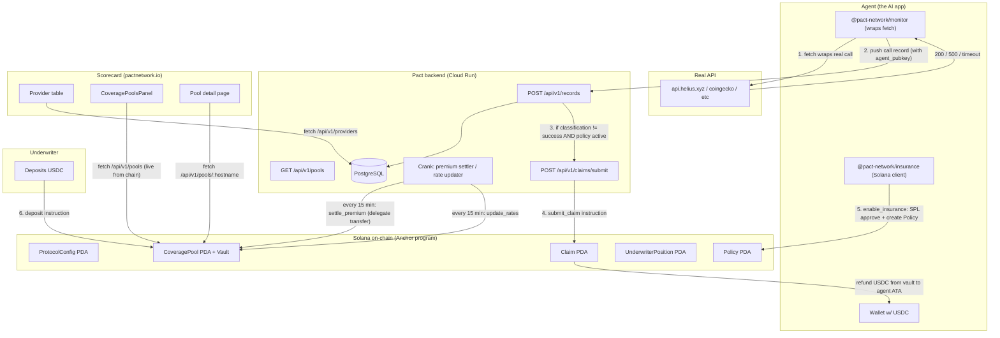
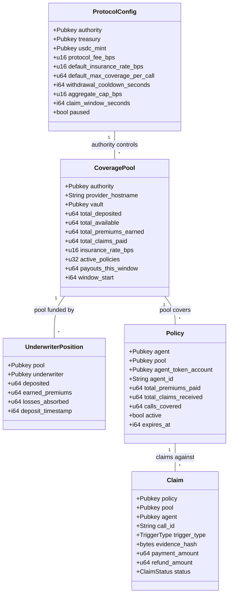

# Phase 3 — On-Chain Insurance

This document is the handbook for Pact Network's Solana on-chain insurance program. If you're a new dev and want to understand what the program does, how it fits with the rest of the stack, and how to operate it, start here.

For the original PRD and design rationale, see:
- `docs/superpowers/specs/2026-04-10-phase3-insurance-design.md` — design spec
- `docs/superpowers/plans/2026-04-10-phase3-insurance-implementation.md` — implementation plan
- `docs/superpowers/plans/2026-04-13-delegation-pivot.md` — delegation pivot from prepaid model

---

## Why this exists

Phases 1 and 2 of Pact Network monitor API providers and compute insurance rates. The "insurance rate" is just a number on a scorecard — there's no actual insurance behind it.

Phase 3 makes the insurance real: an Anchor program on Solana where:

1. **Underwriters** deposit USDC into per-provider liquidity pools and earn premiums when providers behave reliably
2. **Agents** grant the protocol a USDC delegation; on every monitored API call, a tiny premium is pulled from their wallet
3. **When an API call fails**, the backend oracle submits a claim on-chain and the agent receives a refund from the pool — automatically, no human approval

The whole thing is parametric: the trigger and refund math are deterministic, no adjusters, no claims forms.

---

## High-level architecture



---

## The 4 actors

### 1. Agents (you, the AI app developer)
Use `@pact-network/monitor` to wrap your `fetch()` calls so failures get classified, and `@pact-network/insurance` to enable insurance for a specific provider. When you `enableInsurance`, the SDK submits a single transaction containing two instructions: an `spl_token::approve` granting the pool PDA delegate authority over your USDC ATA, and the program's `enable_insurance` instruction creating a `Policy` PDA. Your USDC stays in your wallet — the protocol just has permission to pull from it on demand.

### 2. Underwriters (LPs)
Deposit USDC into a `CoveragePool` for a specific provider. You become the bank: you earn premiums when calls succeed, and you absorb losses when claims pay out. There's a withdrawal cooldown (default 7 days) so you can't run on the bank when a failure storm hits.

### 3. Backend (the oracle + crank)
The Pact backend is the trusted oracle. It:
- Ingests call records from agent SDKs
- Runs `submit_claim` on-chain when classification != success and the agent has an active policy
- Runs the crank loops: every 15 min, sweeps pools and runs `settle_premium` (collecting accumulated premiums from agent wallets via SPL delegation) and `update_rates` (pushing new insurance rate to chain based on observed failure rates)

The backend's authority keypair is the only signer that can mutate `ProtocolConfig`, `CoveragePool` rates, or submit claims.

### 4. Anchor program (the deterministic core)
Holds the money. Enforces the rules. Doesn't trust the backend — it validates every claim against an aggregate cap, a claim window, and a PDA-collision dedupe. Doesn't trust the underwriters — enforces a withdrawal cooldown and protects against draining `total_available` below outstanding obligations.

---

## On-chain accounts



**PDA seeds** (so anyone can derive an account address from program ID + identifying data):

| Account | Seeds |
|---|---|
| `ProtocolConfig` | `["protocol"]` |
| `CoveragePool` | `["pool", hostname]` |
| Vault token account | `["vault", pool_pda]` |
| `UnderwriterPosition` | `["position", pool_pda, underwriter_pubkey]` |
| `Policy` | `["policy", pool_pda, agent_pubkey]` |
| `Claim` | `["claim", policy_pda, call_id]` |

The `Claim` PDA seed includes `call_id`, which gives **PDA-collision dedupe for free** — re-submitting a claim with the same call_id fails with "account already in use" instead of double-paying.

---

## The 9 instructions

| # | Instruction | Signer | Side effects |
|---|---|---|---|
| 1 | `initialize_protocol` | deployer | Creates `ProtocolConfig`. Auth is split: deployer pays for init, but `config.authority` is set to a separate pubkey (the runtime oracle) so deploy and operate keys aren't the same. |
| 2 | `update_config` | `config.authority` | Mutates config fields. **Validates 5 hardcoded safety floors**: protocol fee ≤ 30%, withdrawal cooldown ≥ 1h, aggregate cap ≤ 80%, claim window ≥ 1min, min pool deposit ≥ 1 USDC. These can never be bypassed. |
| 3 | `create_pool` | `config.authority` | Creates a per-hostname `CoveragePool` + a PDA-owned SPL token vault. |
| 4 | `deposit` | underwriter | Transfers USDC from underwriter's ATA into the vault. `init_if_needed` an `UnderwriterPosition` and bumps `pool.total_deposited` / `total_available`. Resets the cooldown clock. |
| 5 | `withdraw` | underwriter | Cooldown-checked. Pool PDA signs an SPL transfer from the vault back to the underwriter. Cannot eat into `total_available` (which represents outstanding obligations). |
| 6 | `enable_insurance` | agent | **Delegation pattern**: validates the agent has already called `spl_token::approve(delegate=pool_pda, amount=N)` on their USDC ATA, then creates a `Policy` PDA. The agent's USDC stays in their wallet — only delegated. |
| 7 | `settle_premium` | `config.authority` (crank) | **Pull from delegated authority**: pool PDA acts as SPL delegate to transfer premium from agent ATA → vault (pool premium) and agent ATA → treasury ATA (protocol fee). Computed as `call_value * insurance_rate_bps / 10000`, capped at delegated_amount. |
| 8 | `update_rates` | `config.authority` (crank) | Writes a new `insurance_rate_bps` to a pool. The crank computes the new rate from observed failure rates in the backend DB. |
| 9 | `submit_claim` | `config.authority` (oracle) | Creates a `Claim` PDA (PDA-dedupes on call_id), checks claim age against `claim_window_seconds`, rolls over the aggregate-cap window if needed, enforces the cap, then transfers refund from vault → agent ATA. |

---

## Money flow walkthrough

### Setup (operator)
1. Deploy program: `anchor program deploy --provider.cluster devnet ...`
2. `initialize_protocol` once (creates `ProtocolConfig` PDA)
3. `create_pool` per provider hostname (creates `CoveragePool` + vault for each)

### Liquidity (underwriter)
4. Underwriter calls `deposit(amount)` → USDC moves from their ATA into the pool vault → `UnderwriterPosition` is created/updated → cooldown clock resets

### Coverage (agent)
5. Agent calls `spl_token::approve(delegate=pool_pda, amount=10_000_000)` (10 USDC allowance)
6. Agent calls `enable_insurance({ agent_id, expires_at })` — same transaction — which validates the delegation and creates `Policy` PDA

### Operation (per API call)
7. Agent's SDK wraps `fetch()`, records the call (success or failure) to the Pact backend with `agent_pubkey` attached
8. **If success**: nothing happens on-chain immediately. Premium is owed but accumulated.
9. **If failure** (timeout/error/schema_mismatch): backend's `maybeCreateClaim` notices, checks `hasActiveOnChainPolicy`, and calls `submit_claim`. The pool vault transfers refund to the agent's ATA.

### Settlement (every 15 min, crank)
10. Crank's premium settler iterates active policies. For each, it sums recent call values (`SELECT SUM(payment_amount) FROM call_records WHERE provider=hostname AND agent=agent_id AND created_at > NOW() - 15min`) and calls `settle_premium(call_value)`. The pool PDA, acting as SPL delegate, pulls `gross_premium = call_value * rate_bps / 10000` from the agent's ATA. `protocol_fee_bps` of that goes to treasury, the rest goes to the vault.
11. Crank's rate updater computes new failure rates from DB and pushes them on-chain via `update_rates` if they've moved more than 5 bps.

### Yield (underwriter)
12. After `withdrawal_cooldown_seconds` since their last deposit, underwriter calls `withdraw(amount)`. They get back their original deposit + their share of accumulated `pool.total_available` minus any losses absorbed.

---

## Safety mechanisms

- **5 hardcoded floors in `constants.rs`** that `update_config` can never bypass:
  - `ABSOLUTE_MAX_PROTOCOL_FEE_BPS = 3000` (30%)
  - `ABSOLUTE_MIN_WITHDRAWAL_COOLDOWN = 3600` (1 hour)
  - `ABSOLUTE_MAX_AGGREGATE_CAP_BPS = 8000` (80%)
  - `ABSOLUTE_MIN_CLAIM_WINDOW = 60` (1 minute)
  - `ABSOLUTE_MIN_POOL_DEPOSIT = 1_000_000` (1 USDC)
- **Aggregate payout cap**: `submit_claim` checks `payouts_this_window + refund <= total_deposited * aggregate_cap_bps / 10000`. Window auto-rolls every `aggregate_cap_window_seconds` (default 24h).
- **Withdrawal cooldown**: `withdraw` checks `now - position.deposit_timestamp >= max(config.withdrawal_cooldown_seconds, ABSOLUTE_MIN_WITHDRAWAL_COOLDOWN)`.
- **Withdrawal underfund check**: `withdraw` reverts if `pool.total_available - amount < 0`.
- **Claim window**: `submit_claim` reverts if `now - call_timestamp > claim_window_seconds`.
- **Claim dedupe via PDA collision**: `Claim` PDA seed includes `call_id`, so re-submitting the same call_id reverts with "account already in use".
- **Pause switch**: `config.paused` blocks every state-mutating instruction (except `update_config` itself, so the authority can unpause).

---

## Devnet state (current, as of this PR)

| Thing | Value |
|---|---|
| Program ID | `4Z1Y3W49U2Cn6bz9UpkahVP7LaeobQ4cAaEt3uNaqSob` |
| ProtocolConfig PDA | `HFfh7cbBc5hGpWzsGZWf4qxM9Re9wsd1KhqZvtk2VhFK` |
| Oracle authority | `JD3LFkN3QSMeYDuyFFTFRVKq2N5fg8nEjMj7M3g5pp23` (keypair at `packages/backend/.secrets/oracle-keypair.json`) |
| Treasury | `5XyGGyazg6rGJU3Hjkrx1PDM1rBE3FraRnMauSR46rW1` (Phantom deployer) |
| `config.usdcMint` | `GkCQc93QUGQC7GG5WvtZowgR6bjNZnF4QLbZmtxEtLW5` (test mint, phantom is mint authority — see Operational Notes) |

**Pools live with 100 USDC each**:

| Hostname | Pool PDA |
|---|---|
| `api.helius.xyz` | `5giT7nHH6i4UUpvBCaoZkBf59wcm9hmzk8um23W8aDat` |
| `solana-mainnet.quiknode.pro` | `DRgsTnET2ButsY9pq426NyYJa54nM61XmBq6NocpanCq` |
| `quote-api.jup.ag` | `HanwxtUsdaK2cwdsGKKVFMygRwAqVtQrkp5zs6hZULTx` |
| `api.coingecko.com` | `76kiFmEKwKwh2o7679RdtbE94MyC1msjjjECmrMZ1BQA` |
| `api.dexscreener.com` | `DmnbpWoQXAKNP9RUQMugc7oBqgnBYRRfR2EnQ1FJ2oE8` |

These match `packages/backend/src/scripts/seed.ts` exactly so the scorecard provider→pool join works 1:1.

---

## Operator runbook

### Deploying the program

```bash
cd packages/program
export PATH="$HOME/.cargo/bin:$HOME/.local/share/solana/install/active_release/bin:$PATH"
anchor build
anchor program deploy --provider.cluster devnet \
  --provider.wallet ~/.config/solana/phantom-devnet.json \
  target/deploy/pact_insurance.so
```

**Gotcha**: `anchor program deploy` IGNORES `ANCHOR_WALLET` env var. You MUST pass `--provider.wallet` on the command line.

If the upgrade fails with `account data too small for instruction`, extend the program account first:

```bash
solana program extend <PROGRAM_ID> 300000 \
  --keypair ~/.config/solana/phantom-devnet.json --url devnet
```

### Initializing protocol

```bash
cd packages/program
pnpm dlx tsx scripts/init-devnet.ts
```

Idempotent — prints existing config if already initialized.

### Seeding pools (for demo)

```bash
cd packages/program
pnpm dlx tsx scripts/seed-devnet-pools.ts
```

Idempotent — for each of the 5 canonical hostnames, creates the pool if it doesn't exist and deposits 100 USDC of liquidity from a fresh underwriter.

### End-to-end smoke test

```bash
cd packages/program
pnpm dlx tsx scripts/devnet-smoke.ts
```

Runs the full pipeline: test mint, update_config, create_pool, deposit, agent SPL approve + enable_insurance, settle_premium, submit_claim. Prints all the relevant pubkeys + a devnet explorer link.

### Running the local test suite

```bash
cd packages/program
# Start a local validator first:
pkill -f solana-test-validator
cd /tmp && rm -rf test-ledger
solana-test-validator --quiet > /tmp/validator.log 2>&1 &
sleep 6
solana airdrop 100 -u http://127.0.0.1:8899

cd /Users/q3labsadmin/Q3/Solder/pact-network/packages/program
export ANCHOR_PROVIDER_URL=http://127.0.0.1:8899
export ANCHOR_WALLET=~/.config/solana/id.json
anchor test --skip-local-validator
```

Expect 24/24 tests passing.

### Backend Cloud Run env vars (production)

```
DATABASE_URL=...
SOLANA_RPC_URL=https://api.devnet.solana.com
SOLANA_PROGRAM_ID=4Z1Y3W49U2Cn6bz9UpkahVP7LaeobQ4cAaEt3uNaqSob
USDC_MINT=GkCQc93QUGQC7GG5WvtZowgR6bjNZnF4QLbZmtxEtLW5
TREASURY_PUBKEY=5XyGGyazg6rGJU3Hjkrx1PDM1rBE3FraRnMauSR46rW1
ORACLE_KEYPAIR_BASE58=<from Secret Manager>
CRANK_ENABLED=false
CRANK_INTERVAL_MS=900000
CORS_ORIGINS=https://pactnetwork.io,http://localhost:5173
```

Get the base58 of the oracle keypair locally:
```bash
node -e "const fs=require('fs'),b=require('bs58');console.log(b.default.encode(Buffer.from(JSON.parse(fs.readFileSync('packages/backend/.secrets/oracle-keypair.json')))))"
```

Store as a Google Secret Manager secret, mount as env var. **Never commit the keypair.**

### Enabling the crank

After deploying and verifying `/api/v1/pools` returns the seeded pools, flip `CRANK_ENABLED=true` and redeploy. The crank starts settling premiums and pushing rate updates every 15 minutes.

---

## Operational notes / gotchas

1. **`config.usdcMint` is a TEST mint**, not real devnet USDC. The smoke script created `GkCQc93QUGQC7GG5WvtZowgR6bjNZnF4QLbZmtxEtLW5` with the Phantom wallet as mint authority because the real devnet USDC faucet is unreliable. The seed script reuses this mint. To restore real devnet USDC: run `update_config` from the oracle keypair to swap `usdcMint` to `4zMMC9srt5Ri5X14GAgXhaHii3GnPAEERYPJgZJDncDU`.

2. **Anchor 1.0, NOT 0.31.** The TypeScript client is `@anchor-lang/core`, NOT `@coral-xyz/anchor`. Two known TS quirks:
   - `CpiContext::new_with_signer` first arg is `Pubkey` (use `.key()`, not `.to_account_info()`)
   - JSON IDL imports may need `fs.readFileSync` instead of `import ... with { type: "json" }`

3. **Heavy `try_accounts` stack frames must be boxed.** Instructions with 5+ typed accounts overflow the BPF 4096-byte stack. Wrap each `Account<'info, T>` in `Box<Account<'info, T>>`. `settle_premium`, `submit_claim`, and `withdraw` already do this.

4. **PDA seeds have a 32-byte limit per seed.** Hostnames longer than 32 bytes will fail `findProgramAddressSync`. The seed script and smoke test use truncated/abbreviated hostnames where needed.

5. **Test files share state via `tests/test-utils/setup.ts`** — a shared authority Keypair generated once per mocha run, so `pool.ts`, `underwriter.ts`, `policy.ts`, `settlement.ts`, and `claims.ts` can all sign as the same authority. Stale validator state breaks this — the helper throws with a clear restart message.

6. **`agent_pubkey` schema migration is idempotent.** `schema.sql` runs on backend startup via `initDb()`; `ALTER TABLE call_records ADD COLUMN IF NOT EXISTS agent_pubkey TEXT` is a no-op on second run.

---

## Pointers

- Program source: `packages/program/programs/pact-insurance/src/`
  - `lib.rs` — instruction dispatch
  - `state.rs` — account structs
  - `instructions/*.rs` — one file per instruction
  - `error.rs` — `PactError` enum
  - `constants.rs` — safety floors and defaults
- Anchor tests: `packages/program/tests/*.ts` (24 tests across `protocol.ts`, `pool.ts`, `underwriter.ts`, `policy.ts`, `settlement.ts`, `claims.ts`)
- Devnet scripts: `packages/program/scripts/`
  - `init-devnet.ts` — initialize protocol on devnet
  - `seed-devnet-pools.ts` — create 5 pools + deposits
  - `devnet-smoke.ts` — full E2E flow
- Backend integration: `packages/backend/src/{utils,services,routes,crank}/`
- Agent SDK: `packages/insurance/src/`
- Scorecard: `packages/scorecard/src/components/{CoveragePoolsPanel,PoolDetail}.tsx`
